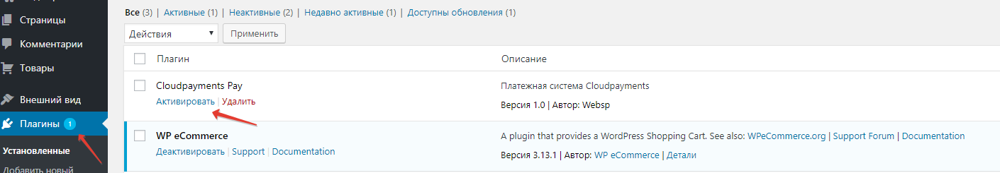
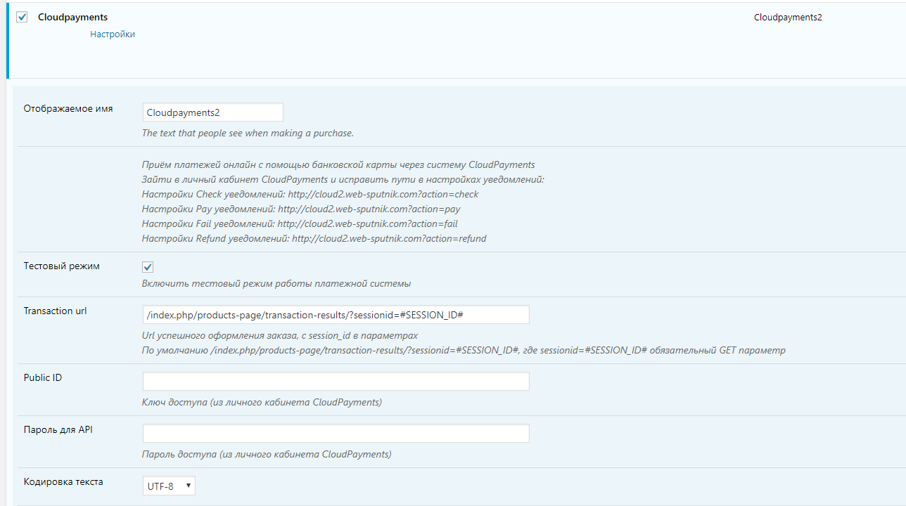
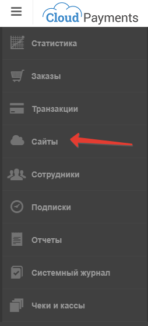
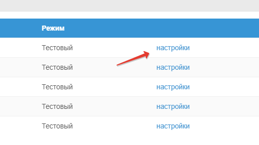
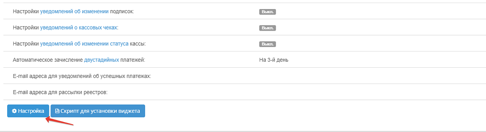

# CloudPayments модуль для Wordpress - eCommerce
Модуль позволит с легкостью добавить на ваш сайт оплату банковскими картами через платежный сервис [CloudPayments](https://cloudpayments.ru).
Для корректной работы модуля необходима регистрация в сервисе и установленный плагин WP eCommerce

### Возможности:  
• Одностадийная схема оплаты;   
• Возврат платежей из ЛК CMS;    
• Отправка чеков по email;

### Совместимость
• Wordpress v.4.9.x и выше;  
• eCommerce v.3.13.x и выше;

### Ручная установка

1.	Скопируйте данные с github
2.	В папку плагинов Wordpress /wp-content/plugins копируем все данные.
3.	Итого в /wp-content/plugins должна быть папка cloudpayments со всем содержимым.
4.	Перейдите в раздел установки плагинов в административной части Wordpress и активируйте  плагин

5.  Чтобы модуль корректно работал, нужно внести ряд изменений в настройки модуля, а также настроить работу вебхуков в личном кабинете - https://merchant.cloudpayments.ru/Account/Login. Настройки модуля и настройки вебхуков описаны ниже.

### Настройка модуля

1.	Все настройки платежной системы находятся в модуле ECommerce. По адресу /wp-admin/options-general.php?page=wpsc-settings. "Настройки -> Магазин -> Платежи".

2.	Выберите из списка платежную систему "Cloudpayments" и перейдите в настройки

Заполните:
- «Public ID»
- «Пароль для API»
Остальные параметры заполняйте на свое усмотрение. 

### Описание параметров модуля:
- **Отображаемое имя** - имя платежной системы на сайте. То имя, что будет отображаться в оформление заказа.
- **Transaction url** - Url успешного оформления заказа, с session_id в параметрах, где sessionid=#SESSION_ID# обязательный GET параметр
- **Кодировка текста** - кодировка всего текста модуля. По умолчанию стоит utf-8, можно сменить на CP1251.
- **Использовать функционал формирования чеков** - формирование и отправка чеков оплаты на email. 
- **Статус возврата платежа** - в этом пункте выбирается какой статус заказа, отвечает за возврат платежа. Т.е. выбрав указанный в этом пункте статус, в заказе, будет выполнена функция возврата платежа через API cloudpayments.
- **Success URL** - url на который будет переадресован пользователь после успешной оплаты заказа.
- **Fail URL** - url на который будет переадресован пользователь после неудачно оплаты заказа.
- **Язык модуля** - язык отображения текста в данных настройках
- **Язык виджета** - список доступных языков виджета оплаты заказа, который появляется когда пользователь нажимает кнопку "оплатить".

### Настройка вебхуков:

Для корректной работы модуля, а именно подтверждения оплаты и прочих действий, нужно прописать правильные url в настройках вебхуков. 

Для настройки вебхуков:
1) Авторизуйтесь в личном кабинете по ссылке https://merchant.cloudpayments.ru/Account/Login
2) Перейдите в "Сайты"  

3) Добавьте свой сайт(если еще не добавили), и перейдите в настройки

3) Откройте "настройки"

Напротив каждой позиции вставьте линк ниже для соответсвующего вебхука:

* (Check) 		#SITE_URL#h?action=check
* (Fail) 		#SITE_URL#?action=fail
* (Pay) 		#SITE_URL#?action=pay
* (Refund)		#SITE_URL#?action=refund

Где #SITE_URL# - адрес сайта. Например: http://domain.ru

### Возврат денежных средств по заказу

Чтобы вернуть д/с за оплаченный заказ клиенту, нужно перейти в редактирование заказа и в статусе заказа выбрать статус выбранный в настройках модуля

После чего будет отправлен refund запрос на возврат оплаты.
